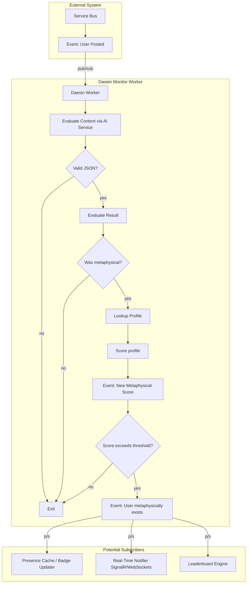
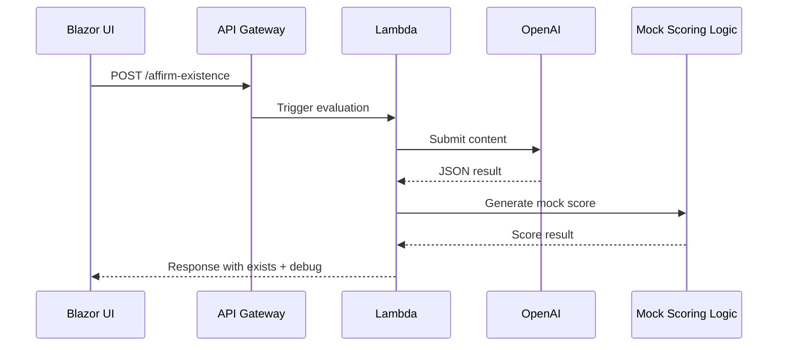

# Heidegger's Dasein Monitor

*"To be marked present, one must first affirm their existence."*

This is a portfolio project designed to demonstrate creative technical fluency, abstract system integration, and absurd-but-memorable engineering. Heidegger’s Dasein Monitor is a metaphysical presence system: users do not exist by default — their existence must be affirmed by the Dasein Monitor.

This system is not a replacement for any regular system function. It is an **out-of-bounds subsystem** intended to augment a user’s profile with existential context. Its failure has no impact on platform function, but its success creates a surreal layer of social presence.

---

## 📘 Philosophical Foundation: Heidegger's Dasein

In Heideggerian philosophy, *Dasein* refers to a being that is aware of and questions its own existence. It is not just being alive or functional—it is *being meaningfully*. Dasein Monitor adapts this concept in absurd earnestness. Users must *introspect* and *submit* content that reflects their awareness, purpose, or metaphysical state. Only if the response includes `"was_metaphysical": true` does the system mark the user as "existent."

The goal is not to test intelligence or sentiment, but **intentional self-awareness**. A post like “I am present because I am seeking meaning” may qualify, while “The beach is nice today” likely won’t.

---

## 🧭 Concept Overview

- Users post content as usual to a social media platform.
- A message from the existing platform's pub/sub system is published when a post is created.
- The Dasein Monitor receives this message out-of-band, evaluates the content, and assigns a "thinking score."
- If the score exceeds a threshold, it publishes a result to **its own pub/sub channel**, triggering other integrations like profile badges, real-time notifications, or existential leaderboards.
- Debug metadata is included in the response for prototype mode.

This system is deliberately absurd—but adds unexpected texture to the user's profile. It is an example of asynchronous event management, eventual consistency and a value-add system that enriches but does not interfere with existent processes.

---

## 🧩 Use Case: Enriching Existing Social Platforms

Dasein Monitor can integrate into a legacy or modern social platform with **no disruption to core features**. It passively consumes post events and emits follow-up messages.

| Integration Point          | Behavior                                                                  |
| -------------------------- | ------------------------------------------------------------------------- |
| **Existing Post Events**   | Listens passively to platform's post event bus (SNS/SQS/EventBridge/etc.) |
| **Profile Badge Updates**  | Emits badge status or existential tag in user profile                     |
| **Gamification Hooks**     | Enables surreal leaderboards of "most present" users                      |
| **Personal Insight Tools** | Users reflect on how often they assert existence                          |
| **Opt-in Widgets**         | Real-time metaphysical presence indicators via embedded component         |

All integration points are **asynchronous** and **non-critical**. If nothing happens, nothing breaks.

---

## 🔧 AI Prompt Design

To ensure the LLM's output is consistent and safe to parse, the system uses the following system message:

```text
You are a digital philosopher, focused on evaluating user posted content to determine if their post demonstrates awareness or not. You should make the determination based on Heidegger's concept of Dasein.

You should always respond only in json with the following payload:
{
      "was_metaphysical": false
}
```

This ensures that all LLM responses are machine-parseable and constrained in scope, without unnecessary explanation or prose.

---

## 🛠️ Prototype Stack (AWS, Minimal Cost)

| Component        | Technology                    | Notes                              |
| ---------------- | ----------------------------- | ---------------------------------- |
| UI               | Blazor WebAssembly on Amplify | Amplify free tier, hosted client   |
| API Ingress      | API Gateway + Lambda          | POST endpoint for standalone test  |
| Evaluation Logic | .NET 8 Lambda Function        | OpenAI call + JSON parsing + score |
| Scoring          | Mocked score (RNG-based)      | No persistence or database         |
| Response         | JSON with `exists` + `debug`  | See format below                   |

---

## 🔁 System-Level Logic Flow



---

## 🧪 Prototype Sequence Diagram



---

## 📦 Response Payload (Prototype Mode)

| Property              | Type     | Description                                           |
| --------------------- | -------- | ----------------------------------------------------- |
| `exists`              | `bool`   | Whether the user is considered metaphysically present |
| `debug.score`         | `int`    | Randomized "thinking score" (0–100)                   |
| `debug.threshold`     | `int`    | Minimum score required to be considered present       |
| `debug.metaphysical`  | `bool`   | Whether the AI judged the post as metaphysical        |
| `debug.valid`         | `bool`   | Whether the AI response was valid JSON                |
| `debug.aiResponseRaw` | `string` | Raw text from LLM (optional)                          |
| `debug.parsedJson`    | `object` | Parsed JSON output from LLM (for inspection)          |

---

## 📤 Example Requests

```json
// should be existential
{
  "userId": "demo123",
  "content": "To be is to be perceived, and I perceive myself now."
}

// not existential
{
  "userId": "demo321",
  "content": "The beach is cool in summer. We had margaritas by the sea."
}
```

## ✅ Example Responses

```json
// is existential
{
  "exists": true,
  "debug": {
    "score": 82,
    "threshold": 70,
    "metaphysical": true,
    "valid": true,
    "aiResponseRaw": "{ \"was_metaphysical\": true }",
    "parsedJson": {
      "was_metaphysical": true
    }
  }
}
```

```json
// is not existential
{
  "exists": false,
  "debug": {
    "score": 82,
    "threshold": 70,
    "metaphysical": false,
    "valid": true,
    "aiResponseRaw": "{ \"was_metaphysical\": false }",
    "parsedJson": {
      "was_metaphysical": false
    }
  }
}
```

---

## 🧑‍💻 Developer Notes

- **OpenAI prompt** must constrain the model to reply with a strict JSON body:
  ```json
  { "was_metaphysical": true }
  ```
  or
  ```json
  { "was_metaphysical": false }
  ```
- **No persistence** in prototype—score is randomized server-side for demo purposes.
- **Blazor UI** simulates badge or presence indicator based on returned `exists` flag.
- **Post events are consumed passively** via service bus.
- **Subsystem is silent on failure**

This project highlights the absurd elegance of creating structure around introspection. In production, it could become a novelty-driven badge system or an opt-in existential awareness module for social systems.

> *"Existence isn’t just being online... it’s being aware you are."*

